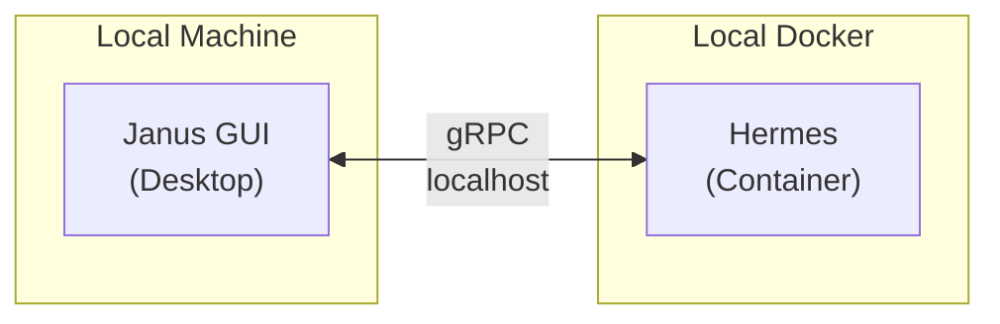
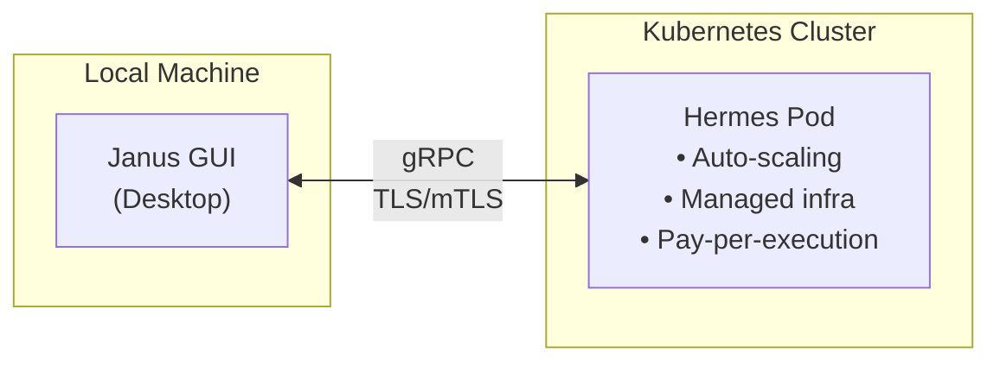
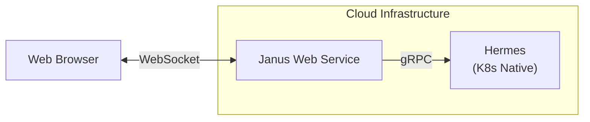
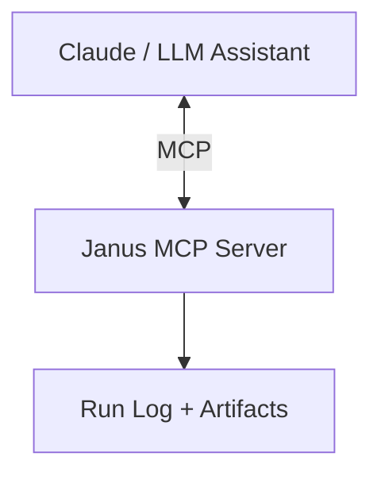

# Why Janus

## Executive Summary

Janus is a modern replacement for Certara Pirana, the dominant GUI tool for pharmacometric modeling workflows. Built in Go with a focus on workflow efficiency, container orchestration, and regulatory compliance, Janus addresses fundamental pain points that have plagued the pharmaceutical modeling community for years.

---

## What is Janus?

Janus is a desktop application for managing pharmacometric model execution—primarily NONMEM, with multi-modal support planned for Stan, Monolix, and other modeling languages. It handles:

- **Model loading and editing** — Work with control streams (.mod, .ctl) directly
- **Execution orchestration** — Submit jobs locally, to grid schedulers (SLURM, SGE, TORQUE), or to containerized environments
- **Run tracking** — Immutable execution logs with cryptographic signing for CFR 21 Part 11 compliance
- **Results management** — Automatic artifact collection, compression, and embedded storage

The key differentiator: **Hermes**, our container orchestration layer that wraps execution environments entirely, solving the validation problem at the infrastructure level.

---

## Why Now?

### Market Sentiment Shift

Certara's stock (CERT) has faced significant headwinds, with analyst concerns centering on:

1. **Pricing pressure** — Per-seat licensing costs have become untenable for academic institutions and smaller pharma
2. **Software-segment softness** — Certara's software growth has lagged its services growth, with management attributing the gap to reprioritization among large pharma customers
3. **Cloud transition friction** — Mandatory cloud licensing and cloud-only architectures do not fit customers who run modeling on their own HPC

This creates a window for alternatives that weren't viable when Certara commanded market confidence.

### Workflow Friction That Drove Hermes

The catalyst for Janus wasn't just cost—it was the fundamental friction in existing workflows:

**The Validation Problem**: In regulated environments (GxP), every software component touching the model-to-result pipeline requires validation. Traditional approaches mean validating:
- The operating system
- NONMEM installation
- PSN/BBI tooling
- Grid scheduler configuration
- File system permissions
- User environment variables

This creates a **validation matrix that scales geometrically** with infrastructure complexity.

**The Hermes Solution**: Container orchestration inverts this problem. When execution happens inside a validated container:
- The **container image is the validation artifact**
- Host system configuration becomes irrelevant
- Results are reproducible across any Docker-capable host
- A single container image serves as the IQ/OQ documentation

This isn't just convenience—it's a **10x reduction in validation effort** for regulated environments.

---

## Key Differentiators

### 1. Container-First Execution (Hermes)

Unlike Pirana's assumption of locally-installed NONMEM, Janus treats containerized execution as a first-class citizen:

- **Self-contained execution** — Model files, data, and license sent as byte streams via gRPC
- **No volume mounts** — Nothing persists on the host; everything returns via the response
- **License injection at runtime** — NONMEM licenses never touch container filesystems
- **Atomic validation** — Validate the container once, run anywhere

#### Why gRPC Changes Everything

Hermes uses gRPC as its communication protocol—a deliberate architectural choice with significant implications:

**Today: Desktop + Local Containers**

**Tomorrow: Desktop + Cloud Execution**

**Future: Web UI + Cloud-Native**

The gRPC contract is **transport-agnostic**. The same Hermes service that runs on a modeler's laptop today can run as a Kubernetes deployment tomorrow—no protocol changes, no API rewrites. The desktop client simply points to a different endpoint.

This means:
- **Pharma IT can offer Hermes-as-a-Service** — Managed execution infrastructure with centralized validation
- **Cloud bursting** — Local execution for quick iterations, cloud execution for heavy workloads
- **Web UI migration path** — The desktop GUI can eventually be replaced or supplemented by a web interface; the backend remains unchanged
- **Multi-tenant SaaS potential** — Same Hermes, different authentication layer

**Why this matters to investors**: Janus isn't locked into the desktop paradigm. The gRPC architecture provides a clear evolution path from desktop tool → hybrid cloud → fully cloud-native, without rewriting the execution layer. We're building the cloud-native future while shipping a desktop product today.

### 2. Run Log as Single Source of Truth

Execution history isn't just metadata—it's the compliance documentation:

- **Embedded results** — .lst, .ext, .phi, .xml files stored directly in the run log
- **Compression** — 56-98% storage reduction (typical NONMEM output: 97-98%)
- **Cryptographic signing** — RSA signatures for CFR 21 Part 11 audit trails
- **Backend-agnostic** — Filesystem, PostgreSQL, or S3 storage

Traditional tools scatter artifacts across directories. Janus consolidates everything into a portable, queryable, signable record.

### 3. No Firewall Holes Required

Pirana requires periodic license validation calls to Certara servers. In airgapped pharmaceutical environments (common in manufacturing and certain regulated contexts), this is a dealbreaker.

Janus licensing uses:
- **Offline-capable JWT tokens**
- **Local validation against embedded public keys**
- **No home-phone requirement**

### 4. AI-Forward Platform

Janus ships with a native **Model Context Protocol (MCP) server**, making it a first-class citizen in AI-assisted workflows:

**What the MCP server exposes:**
- **Run log queries** — "Show me all failed runs from last week"
- **Artifact inspection** — "What were the final parameter estimates for run 042?"
- **Execution triggering** — "Re-run this model with MAXEVAL=9999"
- **Comparative analysis** — "Compare OFV across these three runs"

**Why this matters:**

Traditional pharmacometric workflows require modelers to context-switch between tools: run a model, open results in a text editor, copy values into documentation, compare against previous runs manually. AI assistants can help—but only if they can *access* the execution history.

Janus's MCP server bridges this gap. An AI assistant can:
1. Query the run log to understand what's been tried
2. Inspect actual output files (embedded in the run log)
3. Reason about model development trajectory
4. Suggest next steps based on historical patterns
5. Trigger new executions directly

This isn't a bolt-on integration—it's architectural. The same run log that provides compliance documentation becomes the knowledge base for AI-assisted modeling.

**Investor perspective**: As AI copilots become standard in scientific workflows, tools that are "AI-ready" will have a significant adoption advantage. Janus is positioned for this shift today, not retrofitting it later.

### 5. Multi-Modal Future

While NONMEM dominates pharmacometric modeling, the field is diversifying:
- **Stan** — Bayesian inference gaining traction
- **Monolix** — Strong in Europe
- **nlmixr2** — Open-source R-based alternative

Janus's architecture abstracts the "executor" concept, allowing plug-in support for multiple modeling languages without core changes.

---

## Technical Architecture (Summary)

| Component | Technology | Purpose |
|-----------|------------|---------|
| GUI | Go + Fyne.io | Cross-platform desktop (Windows, Linux, macOS) |
| Orchestration | Hermes (gRPC) | Container lifecycle management |
| Execution | Docker/Podman | Isolated runtime environments |
| Run Log | Embedded SQLite / PostgreSQL | Execution history with signing |
| Grid Integration | SLURM REST API, CLI adapters | Enterprise cluster submission |

Full technical details in [TECHNICAL_OVERVIEW.md](./TECHNICAL_OVERVIEW.md).

---

## Competitive Positioning

| Feature | Janus | Pirana | PSN/BBI (CLI) |
|---------|-------|--------|---------------|
| Container orchestration | Native | No | Partial |
| Offline licensing | Yes | No | N/A (OSS) |
| Embedded run artifacts | Yes | No | No |
| Cryptographic audit log | Yes | No | No |
| Grid scheduler support | Full | Full | Full |
| Multi-modal (Stan, Monolix) | Planned | No | Partial |
| Per-seat licensing cost | Lower | High | Free |

---

## Business Model

**Pricing tiers** (subject to finalization):

1. **Community** — Free for academic/non-commercial use
2. **Professional** — Per-organization annual licensing
3. **Enterprise** — Includes Hermes container images, priority support, validation packages

**Revenue drivers**:
- Professional/Enterprise licenses
- Pre-validated container images (NONMEM 7.4, 7.5, 7.6 etc.)
- Validation documentation packages (IQ/OQ templates)
- Custom integration services

---

## Why This Team?

*[Section intentionally left for your input — investor docs typically include team background]*

---

## Investment Opportunity

Janus targets an underserved segment: pharmacometric teams who need:
- Modern tooling without enterprise pricing
- Regulatory compliance without infrastructure complexity
- Cloud-ready workflows without vendor lock-in

The market timing aligns with:
- Certara sentiment downturn creating switching consideration
- Cloud migration in pharmaceutical IT
- Container adoption in regulated industries
- Increasing NONMEM licensing costs pushing users toward efficient tooling

---

## Next Steps

1. **Technical due diligence** — Review [TECHNICAL_OVERVIEW.md](./TECHNICAL_OVERVIEW.md)
2. **Demo** — See Janus + Hermes in action
3. **Pilot discussion** — Identify early adopter organizations for validation

---

*"Less hype, more function—build something that works, adoption will follow."*