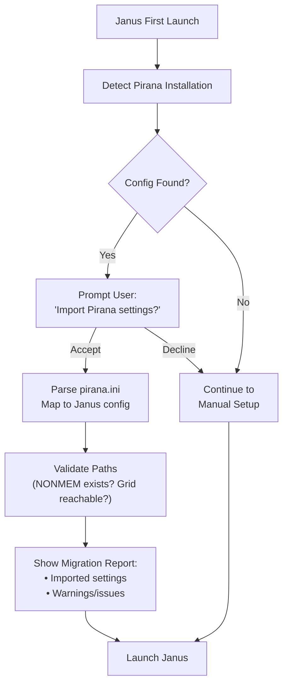
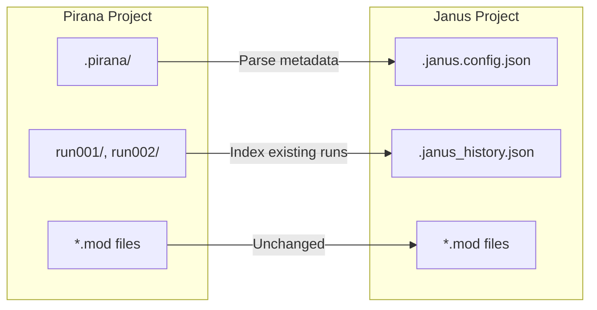

# Proposal: Pirana Configuration Migration

> **Status (v1 implemented).** Core detection + import is implemented in
> `internal/pirana` and wired into the GUI setup wizard ("Import from Pirana")
> and the Settings dialog ("Set from Pirana"). See **Implemented Design** below.
> The remaining phases (project-structure / run-history migration) are still
> proposals.

## Overview

Make Janus a **drop-in replacement** for Pirana by automatically detecting and importing existing Pirana configurations. Users switching from Pirana should be able to launch Janus and immediately have their NONMEM paths, grid settings, and project structure recognized.

## Implemented Design (v1)

**Storage reality.** Modern Certara-era Pirana (3.0+/23.x/25.x) stores its global
preferences in a **SQLite database `settings.db`** inside the Pirana home — *not* a
flat INI file. Legacy and PiranaJS variants do use a Windows-style `*.ini`. The
migrator is therefore **format-agnostic**: it locates the Pirana home, then
dispatches to a SQLite reader or an INI reader based on what it finds.

**Pirana home detection order** (`internal/pirana/locate.go`):
`PIRANA_HOME` → `~/.pirana` → `~/pirana` → `%LOCALAPPDATA%\.pirana` →
`%APPDATA%\Pirana`. Within a home, `settings.db` is preferred over `pirana.ini`.

**SQLite reader** (`internal/pirana/sqlite_reader.go`): Certara does not publish the
`settings.db` schema, so the reader is **introspection-first** — it copies the DB to
a temp file (never touching the original), enumerates user tables via
`sqlite_master`, and harvests both key/value-style tables and wide tables into a
flattened `key→value` map. A shared substring matcher (`internal/pirana/mapping.go`)
then recognizes the settings Janus understands. Uses the pure-Go
`modernc.org/sqlite` driver (no CGO). If a user's schema isn't recognized, a manual
file-picker fallback lets them select the DB directly.

**v1 field mapping** (only settings with a real Janus home):

| Pirana value | Janus `config.Input` field |
|--------------|----------------------------|
| NONMEM installation path | `NonmemPath` |
| NONMEM version / `nmfeNN` | `NonmemBinary` (normalized, e.g. `7.5` → `nmfe75`) |
| Default / start-in directory | `DefaultDirectory` |
| Grid type (SGE/Slurm/Torque/jsub-Torque) | `Scheduler` (Slurm→`SLURM`, SGE→`SGE`, Torque & jsub-Torque→`TORQUE`) |
| Name of researcher | `Organization` (loose; only fills a blank) |

**Detected but not imported** (no Janus home yet — surfaced in the migration report
so nothing is silently dropped): PsN, remote SSH host/mount mapping, R path,
pyDarwin, NLME, Stan. The GUI only *prefills* the form; the user still reviews and
saves via the existing Viper-backed save path — the migrator never writes
`config.yml` itself.

## Original Proposal (background)

## Goals

1. **Zero-friction migration** — Detect Pirana config on first launch, offer one-click import
2. **Preserve user investment** — Honor existing project structures, run directories, model organization
3. **Transparent mapping** — Clear documentation of what maps where
4. **Non-destructive** — Read Pirana config, never modify it; users can run both tools side-by-side

## Pirana Configuration Sources

Pirana stores configuration in several locations depending on version and platform:

### Primary Configuration File

**Location (varies by platform/version):**
- Windows: `%APPDATA%\Pirana\pirana.ini` or `%USERPROFILE%\.pirana\pirana.ini`
- Linux: `~/.pirana/pirana.ini` or `~/.config/pirana/pirana.ini`
- macOS: `~/Library/Application Support/Pirana/pirana.ini`

**Note:** Certara-era distributions may use different paths. Need to verify current locations.

### Key Configuration Elements

| Pirana Setting | Janus Equivalent | Notes |
|----------------|------------------|-------|
| `nm_installation_path` | `nonmem-path` | Path to NONMEM installation |
| `nm_version` | `nonmem-binary` | e.g., `nmfe74`, `nmfe75` |
| `psn_path` | `psn.path` | PsN installation directory |
| `default_dir` | `default-directory` | Default model directory |
| `grid_type` | `scheduler` | SLURM, SGE, TORQUE, etc. |
| `grid_*` settings | `slurm.*` / `sge.*` | Scheduler-specific config |
| `r_path` | (future) | R installation for diagnostics |
| `project_dirs` | `projects` | Recent/saved project locations |

## Migration Flow



## Implementation Details

### Phase 1: Configuration Detection

```go
type PiranaConfig struct {
    NonmemPath     string
    NonmemVersion  string
    PSNPath        string
    DefaultDir     string
    GridType       string
    GridSettings   map[string]string
    Projects       []string
}

func DetectPiranaConfig() (*PiranaConfig, error) {
    // Check known locations in order of likelihood
    paths := getPlatformPiranaPaths()

    for _, path := range paths {
        if exists(path) {
            return parsePiranaINI(path)
        }
    }

    return nil, ErrPiranaNotFound
}
```

### Phase 2: INI Parsing

Pirana uses Windows-style INI format:

```ini
[nonmem]
nm_installation_path=C:\nm75
nm_version=75
parafile=C:\nm75\run\mpilinux_12.pnm

[psn]
psn_path=C:\Perl\site\lib\PsN_5_3_1

[grid]
grid_type=SLURM
slurm_partition=compute
slurm_account=pharma

[general]
default_dir=C:\Models
recent_project_1=C:\Models\Project1
recent_project_2=C:\Models\Project2
```

### Phase 3: Validation

After parsing, validate that referenced paths exist:

```go
type MigrationReport struct {
    Imported   []ImportedSetting
    Warnings   []string  // Path doesn't exist, version mismatch, etc.
    Errors     []string  // Critical failures
}

func ValidateMigration(pirana *PiranaConfig) *MigrationReport {
    report := &MigrationReport{}

    // Check NONMEM installation
    if !exists(pirana.NonmemPath) {
        report.Warnings = append(report.Warnings,
            fmt.Sprintf("NONMEM path not found: %s", pirana.NonmemPath))
    }

    // Check PSN installation
    if pirana.PSNPath != "" && !exists(pirana.PSNPath) {
        report.Warnings = append(report.Warnings,
            fmt.Sprintf("PsN path not found: %s", pirana.PSNPath))
    }

    // ... etc
    return report
}
```

### Phase 4: Config Generation

Generate Janus `config.yml` from imported settings:

```go
func GenerateJanusConfig(pirana *PiranaConfig) *config.Config {
    return &config.Config{
        NonmemPath:       pirana.NonmemPath,
        NonmemBinary:     fmt.Sprintf("nmfe%s", pirana.NonmemVersion),
        DefaultDirectory: pirana.DefaultDir,
        Scheduler:        mapGridType(pirana.GridType),
        // ... etc
    }
}
```

## Project Structure Migration

Beyond configuration, Pirana maintains project-level metadata. Consider migrating:

### Pirana Project Files

- `.pirana` directory in project roots
- Model metadata (descriptions, tags)
- Run history (limited — Janus run log is more comprehensive)

### Migration Strategy



## User Experience

### First Launch Dialog

```
┌─────────────────────────────────────────────────────────────┐
│  Pirana Installation Detected                               │
├─────────────────────────────────────────────────────────────┤
│                                                             │
│  Found Pirana configuration at:                             │
│  C:\Users\analyst\.pirana\pirana.ini                        │
│                                                             │
│  Would you like to import your settings?                    │
│                                                             │
│  This will configure:                                       │
│  ✓ NONMEM path (C:\nm75)                                   │
│  ✓ PsN path (C:\Perl\site\lib\PsN_5_3_1)                   │
│  ✓ Grid scheduler (SLURM)                                   │
│  ✓ Default model directory                                  │
│                                                             │
│  Your Pirana installation will not be modified.            │
│                                                             │
│  ┌──────────────┐    ┌──────────────┐                      │
│  │   Import     │    │    Skip      │                      │
│  └──────────────┘    └──────────────┘                      │
└─────────────────────────────────────────────────────────────┘
```

### Migration Report

After import, show summary:

```
┌─────────────────────────────────────────────────────────────┐
│  Migration Complete                                         │
├─────────────────────────────────────────────────────────────┤
│                                                             │
│  Successfully imported:                                     │
│  ✓ NONMEM 7.5 configuration                                │
│  ✓ SLURM grid settings                                      │
│  ✓ Default directory: C:\Models                             │
│                                                             │
│  Warnings:                                                  │
│  ⚠ PsN path not found (C:\Perl\site\lib\PsN_5_3_1)         │
│    → PsN features will be unavailable until configured     │
│                                                             │
│  ┌──────────────┐                                          │
│  │   Continue   │                                          │
│  └──────────────┘                                          │
└─────────────────────────────────────────────────────────────┘
```

## Edge Cases

### Multiple NONMEM Versions

Pirana can manage multiple NONMEM installations. Janus should:
1. Import all detected versions
2. Allow user to select default
3. Provide version switching in execution options

### Certara vs Open-Source Pirana

Configuration paths and formats may differ. Implementation should:
1. Check multiple known locations
2. Handle format variations gracefully
3. Log what was found for debugging

### Platform Mismatch

If migrating from Windows Pirana to Linux Janus (or vice versa):
1. Paths will be invalid
2. Warn user, skip path-based settings
3. Preserve grid configuration (often portable)

## Security Considerations

- Read-only access to Pirana configuration
- No sensitive data should be in pirana.ini (passwords, tokens)
- If credentials found, warn user and skip import of sensitive fields

## Testing Strategy

1. **Unit tests**: INI parsing, config mapping
2. **Integration tests**: Full migration flow with sample configs
3. **Platform tests**: Windows, Linux, macOS path detection
4. **Version tests**: Different Pirana versions (open-source, Certara)

## Open Questions

1. **Certara-era config format**: Need to verify current Pirana config structure
2. **Project metadata depth**: How much Pirana project state to import?
3. **PsN configuration**: Import PsN-specific settings for PSN executor mode?
4. **Run history**: Attempt to index existing Pirana run directories into Janus run log?

## Timeline

| Phase | Scope | Priority |
|-------|-------|----------|
| 1 | Basic config detection + NONMEM paths | High |
| 2 | Grid scheduler import | High |
| 3 | Project structure recognition | Medium |
| 4 | Run history indexing | Low |

## Success Criteria

- User with existing Pirana setup can launch Janus and execute a model within 60 seconds
- No manual path configuration required for standard setups
- Clear feedback when migration is partial or incomplete
