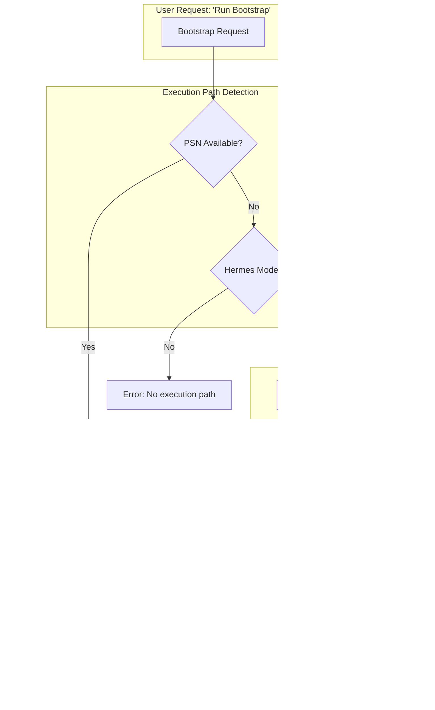
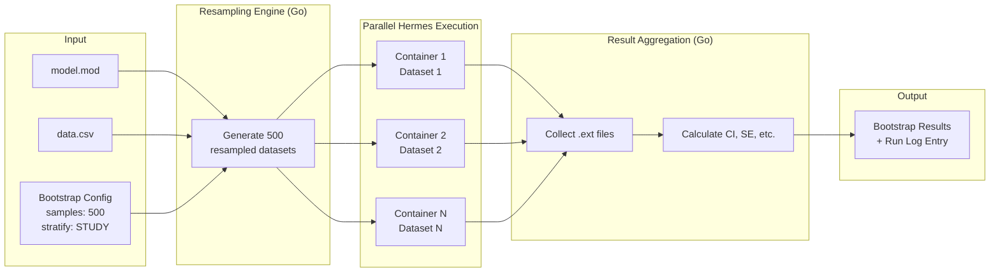

# Proposal: PSN Primitives Support & Hermes Emulation

## Executive Summary

PsN (Perl-speaks-NONMEM) provides critical pharmacometric workflows—bootstrap, VPC, SCM, and more—that Pirana users depend on. This proposal outlines:

1. **Direct PSN support**: Orchestrate PSN tools for users with existing PSN installations
2. **Hermes emulation**: Implement PSN-equivalent functionality natively, eliminating the PSN/Perl dependency entirely

The Hermes emulation path is the strategic differentiator: **bootstrap, VPC, and diagnostics without PSN installation**.

---

## Background: What PSN Provides

| PSN Tool | Purpose | NONMEM Equivalent? |
|----------|---------|-------------------|
| `execute` | Run wrapper with retries, tweaks | `nmfe` (basic) |
| `bootstrap` | Non-parametric bootstrap for CI estimation | None |
| `vpc` | Visual predictive check simulations | Manual simulation |
| `sse` | Stochastic simulation and estimation | None |
| `scm` | Stepwise covariate modeling | Manual |
| `cdd` | Case deletion diagnostics | None |
| `llp` | Log-likelihood profiling | None |
| `sumo` | Summarize NONMEM output | Manual parsing |
| `update_inits` | Update initial estimates | Manual |

**Key insight**: NONMEM itself has no built-in support for bootstrap, VPC, SCM, etc. These are **orchestration patterns** implemented by PSN—running NONMEM many times with different inputs and aggregating results.

This means Janus/Hermes can implement these patterns directly without PSN.

---

## Two-Track Strategy



---

## Track 1: Direct PSN Support

For users with existing PSN installations, Janus acts as an orchestration layer.

### Implementation Approach

```go
type PSNExecutor struct {
    PSNPath     string
    PerlPath    string
    NonmemPath  string
}

func (p *PSNExecutor) Bootstrap(model string, opts BootstrapOptions) (*BootstrapResult, error) {
    // Construct PSN command
    args := []string{
        model,
        "-samples", strconv.Itoa(opts.Samples),
        "-threads", strconv.Itoa(opts.Threads),
    }

    if opts.Stratify != "" {
        args = append(args, "-stratify_on", opts.Stratify)
    }

    // Execute via PSN
    cmd := exec.Command(filepath.Join(p.PSNPath, "bootstrap"), args...)
    // ... stream output, capture results
}
```

### PSN Tools to Support (Phase 1)

| Tool | Priority | Complexity | Notes |
|------|----------|------------|-------|
| `execute` | High | Low | Basic run wrapper |
| `bootstrap` | High | Medium | Most requested |
| `vpc` | High | Medium | Essential for model evaluation |
| `sumo` | Medium | Low | Output summarization |
| `update_inits` | Medium | Low | Workflow helper |
| `scm` | Low | High | Complex covariate workflow |
| `sse` | Low | High | Simulation-estimation |
| `cdd` | Low | Medium | Case deletion |
| `llp` | Low | Medium | Likelihood profiling |

### Configuration

```yaml
# Janus config with PSN
execution-mode: "PSN"

psn:
  path: "/opt/PsN/bin"
  perl: "/usr/bin/perl"
  version: "5.3.1"

nonmem:
  path: "/opt/NONMEM/nm75"
  binary: "nmfe75"
```

---

## Track 2: Hermes Emulation (The Differentiator)

Implement PSN-equivalent functionality directly in Janus, executing via Hermes containers.

### Why This Matters

| With PSN | With Hermes Emulation |
|----------|----------------------|
| Perl installation required | No Perl |
| PSN installation required | No PSN |
| Version compatibility issues | Container = fixed environment |
| Platform-specific Perl quirks | Docker abstracts platform |
| Complex dependency chain | Single container image |
| Validation of PSN required | Validate container only |

**Value proposition**: "Run bootstrap without installing PSN."

### Bootstrap Emulation

**What PSN bootstrap does:**
1. Resample dataset with replacement (N times)
2. Run NONMEM on each resampled dataset
3. Collect parameter estimates
4. Calculate confidence intervals

**Hermes implementation:**



#### Resampling Implementation

```go
type BootstrapEngine struct {
    hermesClient *hermes.Client
    parallelism  int
}

type BootstrapConfig struct {
    Samples     int
    StratifyOn  string   // Column name for stratification
    Seed        int64
    Threads     int      // NONMEM threads per run
}

func (b *BootstrapEngine) Run(model, data string, cfg BootstrapConfig) (*BootstrapResult, error) {
    // 1. Parse original dataset
    originalData, err := nmdata.Parse(data)
    if err != nil {
        return nil, err
    }

    // 2. Generate resampled datasets
    resampler := NewResampler(originalData, cfg.Seed)
    if cfg.StratifyOn != "" {
        resampler.StratifyBy(cfg.StratifyOn)
    }

    datasets := make([][]byte, cfg.Samples)
    for i := 0; i < cfg.Samples; i++ {
        datasets[i] = resampler.Sample()
    }

    // 3. Execute in parallel via Hermes
    results := make(chan *hermes.ExecuteResponse, cfg.Samples)
    sem := make(chan struct{}, b.parallelism)

    for i, ds := range datasets {
        go func(idx int, data []byte) {
            sem <- struct{}{}
            defer func() { <-sem }()

            resp, err := b.hermesClient.Execute(&hermes.ExecuteRequest{
                Model:   model,
                Data:    data,
                Command: fmt.Sprintf("nmfe75 model.mod model.lst"),
            })
            results <- resp
        }(i, ds)
    }

    // 4. Collect and aggregate
    estimates := make([]ParameterEstimates, 0, cfg.Samples)
    for i := 0; i < cfg.Samples; i++ {
        result := <-results
        if result.ExitCode == 0 {
            est, _ := parseExt(result.Artifacts["model.ext"])
            estimates = append(estimates, est)
        }
    }

    // 5. Calculate statistics
    return calculateBootstrapStats(estimates), nil
}
```

#### Stratified Resampling

PSN supports stratified bootstrap (resample within strata). Implement:

```go
type Resampler struct {
    data     *nmdata.Dataset
    strata   map[string][]int  // stratum -> row indices
    rng      *rand.Rand
}

func (r *Resampler) StratifyBy(column string) {
    r.strata = make(map[string][]int)
    for i, row := range r.data.Rows {
        key := row[column]
        r.strata[key] = append(r.strata[key], i)
    }
}

func (r *Resampler) Sample() []byte {
    var sampled []nmdata.Row

    if r.strata != nil {
        // Stratified: resample within each stratum
        for _, indices := range r.strata {
            n := len(indices)
            for i := 0; i < n; i++ {
                idx := indices[r.rng.Intn(n)]
                sampled = append(sampled, r.data.Rows[idx])
            }
        }
    } else {
        // Simple: resample entire dataset
        n := len(r.data.Rows)
        for i := 0; i < n; i++ {
            sampled = append(sampled, r.data.Rows[r.rng.Intn(n)])
        }
    }

    return r.data.Format(sampled)
}
```

### VPC Emulation

**What PSN vpc does:**
1. Simulate from final model (many replicates)
2. Compare simulated distributions to observed data
3. Generate prediction intervals

**Hermes implementation:**

```go
type VPCEngine struct {
    hermesClient *hermes.Client
}

type VPCConfig struct {
    Simulations    int     // Number of simulation replicates
    PredictionLevels []float64  // e.g., [0.05, 0.5, 0.95]
    BinMethod      string  // "equal", "jenks", "manual"
    Bins           int
}

func (v *VPCEngine) Run(model, data string, cfg VPCConfig) (*VPCResult, error) {
    // 1. Modify model for simulation
    simModel := convertToSimulation(model, cfg.Simulations)

    // 2. Execute simulation via Hermes
    resp, err := v.hermesClient.Execute(&hermes.ExecuteRequest{
        Model:   simModel,
        Data:    data,
        Command: "nmfe75 model.mod model.lst",
    })

    // 3. Parse simulation output (sdtab files)
    simData := parseSimulationOutput(resp.Artifacts)

    // 4. Calculate prediction intervals
    vpc := calculateVPC(simData, cfg.PredictionLevels, cfg.BinMethod, cfg.Bins)

    return vpc, nil
}
```

### CDD (Case Deletion Diagnostics)

**What PSN cdd does:**
1. Remove one subject at a time
2. Re-estimate model
3. Identify influential subjects

**Hermes implementation:**

```go
func (c *CDDEngine) Run(model, data string) (*CDDResult, error) {
    // 1. Get unique subjects
    subjects := getUniqueSubjects(data)

    // 2. Create N datasets (each missing one subject)
    datasets := make([][]byte, len(subjects))
    for i, subj := range subjects {
        datasets[i] = removeSubject(data, subj)
    }

    // 3. Parallel execution via Hermes
    results := c.executeParallel(model, datasets)

    // 4. Compare estimates to full-data run
    influence := calculateInfluence(baseEstimates, results)

    return &CDDResult{
        SubjectInfluence: influence,
        CooksDistance:    calculateCooksD(influence),
    }, nil
}
```

---

## Unified Results Format

Whether executed via PSN or Hermes emulation, results feed into the same run log structure:

```json
{
  "id": "bootstrap-001",
  "type": "bootstrap",
  "timestamp": "2024-01-15T14:30:00Z",
  "config": {
    "samples": 500,
    "stratify_on": "STUDY",
    "seed": 12345
  },
  "execution": {
    "mode": "hermes",  // or "psn"
    "successful_samples": 487,
    "failed_samples": 13,
    "duration_ms": 3600000
  },
  "results": {
    "parameters": {
      "THETA1": {
        "estimate": 0.45,
        "se": 0.023,
        "ci_95_lower": 0.41,
        "ci_95_upper": 0.49,
        "cv_percent": 5.1
      }
    },
    "covariance_success_rate": 0.974
  },
  "artifacts": {
    "raw_bootstrap.csv": "H4sIAAAA...(compressed)",
    "bootstrap_summary.txt": "H4sIAAAA..."
  }
}
```

---

## GUI Integration

### Bootstrap Dialog

```
┌─────────────────────────────────────────────────────────────┐
│  Bootstrap Analysis                                         │
├─────────────────────────────────────────────────────────────┤
│                                                             │
│  Model: run042.mod                                          │
│                                                             │
│  Samples: [500____]    Threads per run: [4__]              │
│                                                             │
│  Stratify on: [STUDY      ▼]                               │
│                                                             │
│  ☐ Skip covariance step (faster)                           │
│  ☑ Retry failed samples (up to 3x)                         │
│                                                             │
│  Execution: ◉ Hermes (containerized)                       │
│             ○ PSN (local installation)                      │
│                                                             │
│  Parallelism: [8__] concurrent containers                   │
│                                                             │
│  ┌──────────────┐    ┌──────────────┐                      │
│  │     Run      │    │    Cancel    │                      │
│  └──────────────┘    └──────────────┘                      │
└─────────────────────────────────────────────────────────────┘
```

### Progress Display

```
┌─────────────────────────────────────────────────────────────┐
│  Bootstrap Progress                                         │
├─────────────────────────────────────────────────────────────┤
│                                                             │
│  ████████████████░░░░░░░░░░░░░░  234/500 samples (47%)     │
│                                                             │
│  ✓ Successful: 229                                         │
│  ✗ Failed: 5                                               │
│  ⟳ Running: 8                                              │
│                                                             │
│  Elapsed: 12m 34s    Est. remaining: 14m                   │
│                                                             │
│  Current estimates (preliminary):                           │
│  THETA1: 0.44 (SE: 0.025)                                  │
│  THETA2: 1.23 (SE: 0.089)                                  │
│                                                             │
│  ┌──────────────┐                                          │
│  │    Cancel    │                                          │
│  └──────────────┘                                          │
└─────────────────────────────────────────────────────────────┘
```

---

## Value Proposition Summary

| Scenario | Current State | With Janus |
|----------|---------------|------------|
| Run bootstrap | Install Perl + PSN + configure | Click button |
| New analyst onboarding | 2-4 hours PSN setup | Download Janus, run |
| Validation | Validate PSN + NONMEM + OS | Validate container |
| Platform portability | PSN has platform quirks | Docker runs anywhere |
| Version management | PSN/Perl version hell | Container tag = version |

**The pitch**: "Everything Pirana does with PSN, Janus does without it."

---

## Implementation Phases

### Phase 1: PSN Orchestration (Foundation)
- `execute` wrapper
- `bootstrap` orchestration
- `vpc` orchestration
- Result parsing and run log integration

### Phase 2: Hermes Bootstrap
- Dataset resampling engine
- Parallel container execution
- Result aggregation
- Stratification support

### Phase 3: Hermes VPC
- Simulation model generation
- Prediction interval calculation
- Binning strategies

### Phase 4: Extended Tools
- CDD emulation
- LLP emulation
- SCM (if demand warrants)

---

## Technical Risks & Mitigations

| Risk | Mitigation |
|------|------------|
| PSN edge cases not covered | Start with common workflows, iterate |
| Container startup overhead | Connection pooling, warm containers |
| Large bootstrap sample counts | Efficient parallelism, progress streaming |
| Result format compatibility | Document Janus format, provide export to PSN-compatible |

---

## Open Questions

1. **SCM priority**: Stepwise covariate modeling is complex—defer or implement?
2. **R integration**: VPC visualization typically uses R/ggplot—bundle or external?
3. **PSN result import**: Can we import existing PSN bootstrap results into run log?
4. **Seed compatibility**: Match PSN random seed behavior for reproducibility?

---

## Success Metrics

1. **Parity**: Bootstrap/VPC results match PSN output (within statistical tolerance)
2. **Performance**: Hermes parallel execution faster than serial PSN
3. **Adoption**: Users successfully run bootstrap without PSN installation
4. **Validation**: Single container image satisfies IQ/OQ for all PSN-equivalent tools
