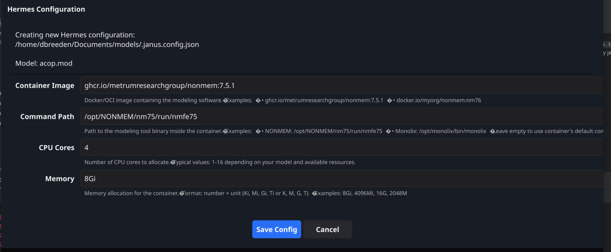

```shell
# Core identification - used for filtering
LABEL io.github.shairozan.janus.type="executor"
LABEL io.github.shairozan.janus.platform="nonmem"

# Display information - shown in Janus UI
LABEL io.github.shairozan.janus.display-name="NONMEM 7.5.1"
LABEL io.github.shairozan.janus.description="NONMEM 7.5.1"

# Version information
LABEL io.github.shairozan.janus.version="0.0.12"
LABEL io.github.shairozan.janus.min-janus-version="0.0.12"

# Platform-specific metadata
LABEL io.github.shairozan.nonmem.version="7.5.1"
LABEL io.github.shairozan.nonmem.compiler="gfortran"
LABEL io.github.shairozan.nonmem.compiler-version="9.4.0"
```

Hermes images are expected to have labels as per the above. If we find `janus.type` 
as executor and `janus.platform` as nonmem, I'd like to see about having them
discovered by janus



Right now on the hermes discovery screen the container image is a fixed
text input. I'd rather that be a combo box where janus discovers appropriate
images and lists them there for selection _or_ a user can input any
given container image they want