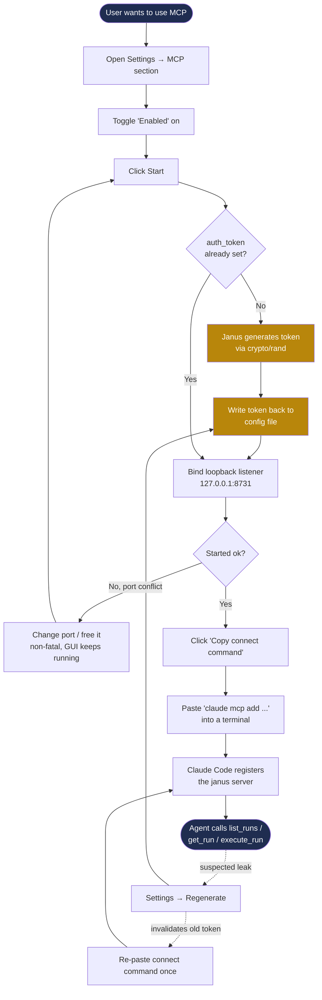

# MCP Server (Model Context Protocol)

## Overview

Janus runs as a long-lived [fyne](https://fyne.io) desktop application. While it
is running it owns rich, model-specific state: a per-model **execution run log**
(`.janus/runlog/*.json` — signed, with embedded output files) and a full
**execution** stack (NONMEM / SLURM / Hermes behind a factory). Today that state
is only reachable through the GUI.

This feature exposes a **Model Context Protocol (MCP) server from the running
Janus process** so that an agent such as Claude Code can, over loopback:

1. **List runs** from a model's run log.
2. **Get full run details** and **full output files** (`.lst`, `.ext`, `.mod`,
   `.phi`, `.xml`, plus captured `stdout`/`stderr`).
3. **Execute new runs as the user** — gated and opt-in.

Because Janus already owns the process's `stdin`/`stdout` (fyne and license
logging write there), the agent must *connect to* Janus over the network rather
than speak MCP over stdio. The transport is therefore **Streamable HTTP bound to
loopback (`127.0.0.1`)**, never stdio.

### Design decisions

- **SDK**: the official `github.com/modelcontextprotocol/go-sdk`.
- **Path-based tools**: read and execute tools accept an optional `model_path`
  argument. The server resolves it to a run-log store for that model. When
  omitted, the tools default to the model currently loaded in the GUI for
  convenience.
- **Execution is double-gated**: a dedicated `mcp.allow_execute` flag (default
  `false`), on top of `mcp.enabled` and a mandatory bearer token. The
  `execute_run` tool is not even registered unless `allow_execute` is set.
- **Runtime control from the GUI**: the MCP server can be started and stopped at
  runtime from the **Settings** dialog (not only auto-started at boot from
  config). A user can enable and start the service without restarting Janus.

## Architecture

The MCP server lives in a new `internal/mcp` package. To respect Janus's
orthogonal architecture ("nothing constructed in lower layers; things are built
at the highest layer and handed down"; no global variables), `internal/mcp` is a
**lower layer** and must **not** import `internal/gui`, `internal/runlog`, or
`internal/execution`.

Instead, `internal/mcp` defines a narrow `Bridge` interface plus plain data
transfer objects (DTOs). The GUI `App` — the highest layer — implements `Bridge`
and hands it to the MCP server at construction. The dependency therefore points
`gui → mcp`, never the reverse.

```
┌───────────────────────────┐
│  internal/gui (App)        │   implements mcp.Bridge,
│   - mcp_bridge.go          │   owns RunLogStore + executor factory,
│   - StartMCPServer()       │   maps runlog.RunRecord → mcp DTOs
└─────────────┬─────────────┘
              │ hands in a mcp.Bridge
              ▼
┌───────────────────────────┐
│  internal/mcp              │   transport + tool registration only.
│   - bridge.go (interface)  │   No gui/runlog/execution imports.
│   - server.go              │
│   - tools.go               │
│   - auth.go                │
└─────────────┬─────────────┘
              │ Streamable HTTP @ 127.0.0.1:<port>
              ▼
        Claude Code / agent
```

### New files

| File | Responsibility |
|------|----------------|
| `internal/mcp/bridge.go` | `Bridge` interface + DTOs (no runlog/execution imports) |
| `internal/mcp/server.go` | `Server` struct, `NewServer`, `Start(ctx)`, `Stop()`, loopback listener, auth-wrapped streamable HTTP handler |
| `internal/mcp/tools.go` | Registers the tools; typed handlers translate MCP calls into `Bridge` calls |
| `internal/mcp/auth.go` | Bearer-token middleware |
| `internal/mcp/*_test.go` | Unit + HTTP round-trip tests against a fake bridge |
| `internal/mcpservice/` | **Fyne-free** `Bridge` implementation + the single headless execute engine (`Service`, `Execute`, `ApplyRunResult`, DTO mapping, the ephemeral store resolver). Shared by the GUI and the daemon |
| `internal/appsetup/` | GUI-free bootstrap shared by the app and daemon: license validation against embedded keys, run-log signer construction |
| `internal/gui/mcp_bridge.go` | Thin GUI seam: the "default to loaded model" resolver, post-run UI refresh, and `buildMCPService()` |
| `cmd/janus/commands/mcp/` | `janus mcp token` (print/provision the bearer token) and `janus mcp server` (headless daemon) |

### Modified files

| File | Change |
|------|--------|
| `internal/config/config.go`, `mcp_token.go` | Add `MCPConfig` + `ValidateMCPConfig`; token primitives (`GenerateMCPToken`, `PersistMCPToken`, `ProvisionMCPToken`) |
| `internal/runlog/store.go` | Cross-process-safe index: atomic write + `flock` read-modify-write so GUI and daemon coexist |
| `internal/gui/app.go` | `mcpServer` field + `modelMu`; delegate execute/apply/pnm to `mcpservice`; stop the server in `Cleanup()` |
| `internal/gui/settings.go` | MCP section (enable, host, port, token, allow-execute) with runtime Start/Stop, Regenerate, Copy connect command |
| `cmd/gui/gui.go`, `cmd/root.go` | Auto-start the server after config/license (non-fatal); register the `mcp` command |

## The Bridge interface

The `Bridge` is the single seam between the MCP transport layer and Janus's
internal state. It is path-based: every read/execute call carries the target
model path (empty means "use the currently-loaded model").

```go
package mcp

type Bridge interface {
    // ListRuns returns run summaries for the model, newest first, plus the total count.
    ListRuns(ctx context.Context, modelPath string, limit, offset int) ([]RunSummary, int, error)

    // GetRun returns full metadata for a single run.
    GetRun(ctx context.Context, modelPath, id string) (*RunDetail, error)

    // ListRunFiles lists the output file keys available for a run
    // (embedded extensions plus the reserved keys "stdout" and "stderr").
    ListRunFiles(ctx context.Context, modelPath, id string) ([]string, error)

    // GetRunFile returns the full content of one output file by key.
    GetRunFile(ctx context.Context, modelPath, id, key string) (*FileContent, error)

    // ExecuteRun launches a model run headlessly and returns immediately.
    ExecuteRun(ctx context.Context, req ExecuteRequest) (*ExecuteResponse, error)

    // Status describes which model is targeted and run-log availability.
    Status(ctx context.Context, modelPath string) (*BridgeStatus, error)
}
```

The DTOs (`RunSummary`, `RunDetail`, `FileContent`, `ExecuteRequest`,
`ExecuteResponse`, `BridgeStatus`) are declared locally in `mcp` so the package
imports no `runlog` or `execution` types. The GUI adapter maps
`runlog.RunRecord` onto them.

```go
type FileContent struct {
    Key       string // "lst", "ext", "mod", ..., or "stdout"/"stderr"
    Content   string // text, or base64 if non-UTF-8
    Bytes     int
    Base64    bool
    Truncated bool   // true if the content was capped
}

type ExecuteRequest struct {
    ModelPath     string
    IsGrid        bool
    IsParallel    bool
    Cores         int
    NonmemOptions string
    Description   string
    DryRun        bool   // return the built command without running
}

type ExecuteResponse struct {
    RunID   string
    Status  string // "running"
    Command string // populated for dry runs
}
```

### Bridge implementation (`internal/gui/mcp_bridge.go`)

The `App` adapter resolves `modelPath` to a `*runlog.RunLogStore`:

- If the path matches the currently-loaded model (`App.currentFilePath`), reuse
  the live `App.runLogStore`.
- Otherwise build an ephemeral store with `runlog.NewRunLogStore(dir, name)`,
  apply the signer / fallback key exactly as `LoadModelFile` does, then `Load()`.
  Ephemeral stores are cached in a small `map[string]*runlog.RunLogStore` guarded
  by a mutex.

It maps `runlog.RunRecord` onto the DTOs using the existing store API:
`GetRuns(limit, offset)`, `GetRun(id)`, `Count()`, `runlog.ExtractEmbeddedFile`,
`runlog.GetEmbeddedFileNames`, and `RunRecord.GetStdout/GetStderr/GetDescription`.
`GetRunFile` caps output (~2 MB), sets `Truncated`, and only base64-encodes
content that is not valid UTF-8. `ExecuteRun` delegates to `App.ExecuteHeadless`.

## Tools

Tools are registered with the official SDK's `mcp.AddTool`, which infers each
tool's JSON input schema from a typed Go input struct. Every handler is a thin
translator: parse typed input → call a `Bridge` method → marshal the result.

| Tool | Input | Bridge method |
|------|-------|---------------|
| `get_run_log_status` | `{model_path?}` | `Status` |
| `list_runs` | `{model_path?, limit?=50, offset?=0}` | `ListRuns` |
| `get_run` | `{model_path?, id}` | `GetRun` |
| `list_run_files` | `{model_path?, id}` | `ListRunFiles` |
| `get_run_file` | `{model_path?, id, key}` | `GetRunFile` |
| `execute_run` | `ExecuteRequest` | `ExecuteRun` *(registered only when `allow_execute`)* |

Notes:

- `get_run_log_status` lets an agent discover the target model and whether the
  run log is available before calling other tools.
- `get_run_file` keys are the embedded file extensions returned by
  `list_run_files`, plus the reserved keys `stdout` and `stderr`.
- `execute_run` is asynchronous. It returns immediately with `run_id` and
  `status: "running"`; the agent polls `get_run` until the status transitions to
  `completed` or `failed` (a real NONMEM run can take many minutes). The HTTP
  handler never blocks on the run.
- Bridge errors (for example "no model loaded" or "unknown run") are surfaced as
  MCP error results.

### Server wiring

```go
srv := mcpsdk.NewServer(&mcpsdk.Implementation{Name: "janus", Version: ver}, nil)

mcpsdk.AddTool(srv, &mcpsdk.Tool{Name: "list_runs", Description: "..."}, h.listRuns)
// ... other tools ...
if cfg.AllowExecute {
    mcpsdk.AddTool(srv, &mcpsdk.Tool{Name: "execute_run", Description: "..."}, h.executeRun)
}

handler := mcpsdk.NewStreamableHTTPHandler(
    func(*http.Request) *mcpsdk.Server { return srv }, nil)

mux := http.NewServeMux()
mux.Handle("/mcp", authMiddleware(token, handler))

ln, err := net.Listen("tcp", net.JoinHostPort(host, strconv.Itoa(port))) // host forced loopback
go httpSrv.Serve(ln)
```

## Lifecycle and Settings control

**Boot auto-start.** In `cmd/gui/gui.go`, after `SetConfiguration` and
`SetLicenseClaims`, `App.StartMCPServer()` is called on both the setup-wizard
completion path and the normal path. It is a no-op unless `mcp.enabled` is set,
and a failure to start (for example a port conflict) is logged but non-fatal —
the GUI continues to run.

**Runtime control from Settings.** The Settings dialog gains an MCP section that
writes `MCPConfig` and offers a **Start / Stop** button calling
`App.StartMCPServer()` / `App.StopMCPServer()`, reflecting the running state.
This lets a user enable and start the service without restarting Janus.

`App.StartMCPServer()` builds `mcp.NewServer(...)` from `App.config.MCP` and the
bridge, then runs it under the app-lifetime context (`App.errorCtx`). It is
idempotent (a no-op if already running). `App.StopMCPServer()` performs a
graceful `http.Server.Shutdown`. The server is stopped at the **top** of
`App.Cleanup()` — before the error channel closes, since the bridge can touch app
state — and it also self-stops when the context is cancelled.

## Headless execution path

The GUI's existing execution path (`executeRun → executeRunWithDescription →
executeLocalRun` / `executeGridRun`) is interleaved with UI dialogs (the
description prompt, the Hermes config dialog, the grid config modal) and must not
be invoked from an MCP request. A dialog-free core is therefore added that both
the GUI and the bridge can call:

```go
func (a *App) ExecuteHeadless(req mcp.ExecuteRequest) (runID, command string, err error)
```

It:

- Resolves `req.ModelPath` (defaulting to `App.currentFilePath`); errors if there
  is no model.
- Resolves the target store via `resolveRunLogStore` (the same path-based
  resolver the bridge uses), so a run is recorded in the correct model's run log.
- Validates the NONMEM / Hermes license using the existing `config` validators
  (`RequiresNONMEMLicense`, `ValidateNONMEMLicenseForExecution`).
- Rejects grid + Hermes; for Hermes it requires an existing `.janus.config.json`
  (it does **not** prompt — `factory.CreateHermesExecutor` errors when the file
  is missing).
- Builds an executor with `execution.NewExecutorFactory(a.config)`, renders the
  command via the executor's `BuildCommand` (model-path-parameterized, so it does
  not depend on the loaded model), creates a `RunRecord` in the target model's
  store, runs the executor in a background goroutine, and writes the result back
  via `applyRunResult` on completion.
- When `DryRun` is set, returns the built command without executing.
- **Grid execution is dry-run only headlessly.** A real grid submission needs the
  interactive scheduler settings the GUI grid modal collects, which an MCP request
  cannot supply; `execute_run` therefore accepts `is_grid` for a dry run (to show
  the command) but rejects a non-dry grid run with a clear error. Local and Hermes
  runs execute fully.

`applyRunResult` is a store-scoped core extracted from the GUI's `updateRunRecord`
(exit code, stdout/stderr, output-file embedding, summary extraction, re-sign +
persist). It performs no UI work, so it is safe to call from the headless
goroutine; `updateRunRecord` now wraps it and adds the GUI refresh.

### Thread safety

MCP handlers run on HTTP goroutines, while fyne widgets must be mutated on the UI
thread and `LoadModelFile` reassigns `currentFilePath` / `runLogStore` on the UI
thread. To keep this correct:

- `modelMu` guards `currentFilePath` and `runLogStore`; the two writes in
  `LoadModelFile` / `setupModelRunHistory` and every read in `resolveRunLogStore`
  take it. The `RunLogStore` itself is already mutex-safe, and ephemeral stores
  are cached under `ephemeralMu`.
- Headless runs intentionally do **not** register into the GUI's `activeRuns` /
  `activeStreams` maps (UI display structures); they manage their own
  goroutine under the app-lifetime context. This keeps the HTTP path off the UI
  bookkeeping entirely rather than adding a lock around it.
- `refreshIfLiveStore` performs the run-history refresh only when the headless run
  targeted the currently-loaded model, dispatching the table refresh via
  `fyne.Do`; runs against other models never touch the UI.

## Configuration

A new `MCPConfig` is added to the `Input` struct in `internal/config/config.go`:

```go
// MCPConfig configures the embedded Model Context Protocol server that lets
// local agents (e.g. Claude Code) query the run log and launch runs.
type MCPConfig struct {
    Enabled      bool   `mapstructure:"enabled" yaml:"enabled"`             // default false
    Host         string `mapstructure:"host" yaml:"host"`                  // default 127.0.0.1 (loopback only)
    Port         int    `mapstructure:"port" yaml:"port"`                  // default 8731
    AuthToken    string `mapstructure:"auth_token" yaml:"auth_token"`      // optional; generated once (crypto/rand) and persisted to config if empty
    AllowExecute bool   `mapstructure:"allow_execute" yaml:"allow_execute"`// default false; gates execute_run
}
```

`ValidateMCPConfig` (called from `NewConfig`) is a no-op when disabled, rejects
any non-loopback host (`127.0.0.1` / `localhost` / `::1` only), and
defaults/validates the port to the range 1024–65535.

### YAML

```yaml
mcp:
  enabled: true
  host: 127.0.0.1
  port: 8731
  auth_token: ""        # empty -> generated once and written back here; stable across restarts
  allow_execute: false  # set true to permit execute_run
```

### Environment variables

With the `JANUS_` prefix and a viper key replacer (`.` → `_`):

- `JANUS_MCP_ENABLED`
- `JANUS_MCP_HOST`
- `JANUS_MCP_PORT`
- `JANUS_MCP_AUTH_TOKEN`
- `JANUS_MCP_ALLOW_EXECUTE`

## Security model

- **Loopback only.** The listener binds to `127.0.0.1`; non-loopback hosts are
  rejected by `ValidateMCPConfig`. The server is never exposed on `0.0.0.0`.
- **Mandatory bearer token.** Every request must carry
  `Authorization: Bearer <token>`. The token is a local *channel* credential —
  deliberately separate from the Janus license JWT. The license is a long-lived
  identity/entitlement that rotates on a billing cadence and verifies against any
  embedded public key (so *any* valid license would authenticate); the MCP token
  is a cheap, disposable, loopback-only capability with a much smaller blast
  radius if leaked. Entitlement is still enforced where it belongs: the
  `execute_run` path validates the NONMEM/Hermes license in `ExecuteHeadless`.
  See **Bearer-token lifecycle** below for how the token is generated and rotated.
- **Execution double-gated.** `execute_run` requires both `mcp.enabled` and
  `mcp.allow_execute`, plus the token. A `dry_run` field returns the generated
  command without running it — matching Janus's IQ/OQ "generate-and-inspect"
  validation philosophy.
- **Scoped file access.** A supplied `model_path` only reaches run-log data the
  user can already read; the bridge builds a store under that model's `.janus/`
  directory and exposes nothing outside the run log.

## Bearer-token lifecycle

The token is optimized for **one-time setup, then zero friction forever**. It is
*not* tied to the license's rotation cycle — coupling the two would force a
re-pair every time a license rolled, which is exactly the kind of friction that
keeps a feature unused.

### Generation

When the MCP server starts with an empty `auth_token`, Janus generates one from
`crypto/rand` (32 bytes, base64url ≈ 43 chars) and **writes it back into the
config file** via the existing `viper.WriteConfig()` / `SafeWriteConfig()` path
used by the Settings dialog. From that point `auth_token` is populated on disk
and every subsequent boot reads the *same* token.

> Implementation note: do **not** reuse `internal/license/jwt/claims.go`'s
> `randomString` helper — it indexes its charset by `time.Now().UnixNano()` and
> is not cryptographically random. The MCP token must come from `crypto/rand`.

### Lifetime

**No automatic expiry.** The token lives until the user explicitly rotates it.
This asymmetry with the license JWT is deliberate: the license expires because it
is an entitlement re-verified against billing; the MCP token is a loopback
capability for a single local user driving their own process, where a rotation
clock buys almost no security but costs a forced re-pair.

### Lifecycle states

| Event | Behavior | User friction |
|-------|----------|---------------|
| First enable (empty token) | Generate (`crypto/rand`) → persist to config → log once | Pair once |
| Every restart | Read existing token from config | **Zero** |
| "Regenerate" button in Settings | New token, overwrite config, old token instantly invalid | Re-pair once, on demand |
| User sets `auth_token` in YAML/env | Honored verbatim, never overwritten | Their choice |
| MCP disabled → re-enabled | Same persisted token reused | Zero |

Rotation is always an explicit, user-driven act — never a timer.

### Pairing affordance

There are two equivalent ways to pair, both zero-friction:

**From the GUI.** The Settings MCP section exposes the token as a copyable field
plus a **"Copy connect command"** button that places the full, ready-to-run line
on the clipboard:

```
claude mcp add --transport http janus http://127.0.0.1:8731/mcp \
  --header "Authorization: Bearer <token>"
```

**From the CLI.** `janus mcp token` prints the bearer token to stdout,
provisioning and persisting one if none is set yet (the same generate-once
invariant). Because it emits only the token, it composes in a shell substitution,
so the connect command needs no copy-paste of the secret at all:

```bash
claude mcp add --transport http janus http://127.0.0.1:8731/mcp \
  --header "Authorization: Bearer $(janus mcp token)"
```

The token is a local *channel* credential, distinct from the Janus license — the
command returns the MCP bearer token, not the license JWT (the server's auth
checks the former).

Click (or run) once → done for the lifetime of the install.

### Setup journey



The happy path is **enable → start → copy → paste**, and after that the token is
stable across every restart. The only branch that ever re-introduces the copy
step is an explicit, on-demand **Regenerate**.

## Edge cases

- **No model loaded and no path** → every tool except `get_run_log_status`
  returns a structured "no model loaded" error.
- **Model switched mid-session** → the bridge always reads the latest store; run
  IDs from a previous model resolve as not-found.
- **Large files / stdout** → `get_run_file` caps content and sets
  `truncated: true` to protect the agent's context window.
- **Port conflict** → `Start` returns an error; it is logged non-fatally and the
  GUI keeps running.

## Validation (IQ/OQ)

Consistent with Janus's validation strategy (generate the call/artifact, then
parse and assert, against mockable seams), the MCP layer is tested through the
`Bridge` interface — no GUI, fyne, or NONMEM required:

- `internal/mcp/tools_test.go`: a `fakeBridge` implementing `Bridge`; each
  handler is called with typed input and asserted on output and on the arguments
  the bridge received (including `model_path` passthrough, `get_run_file`
  stdout/extension routing, truncation, and error → `IsError` mapping).
- `internal/mcp/server_test.go`: the server starts on `127.0.0.1:0` and is driven
  by the SDK HTTP client. Tool discovery lists the expected tools; `execute_run`
  is **absent** when `allow_execute` is false; auth returns 401 without/with a
  wrong token and 200 with the correct one; `Stop()` shuts down cleanly with no
  goroutine leak.
- `internal/gui/mcp_bridge_test.go`: a real temp-directory `RunLogStore` with a
  couple of records asserts `RunRecord` → DTO mapping and file extraction without
  invoking fyne.
- `internal/config/config_test.go`: `ValidateMCPConfig` cases (loopback
  enforcement, port range, disabled passthrough).

All new tests are pure-Go unit tests so CI testing and artifact generation stay
green.

## Running headless (daemon)

The MCP server does not need the GUI. `janus mcp server` runs it as a foreground
process with no fyne dependency, suitable for a **systemd `--user` unit** on a
workbench (e.g. Metworx) or a laptop. It binds loopback, requires the same bearer
token, and runs until `SIGINT`/`SIGTERM`, then shuts down gracefully.

```bash
janus mcp server --license ~/.config/janus/license.jwt --allow-execute
```

Flags: `--license` (JWT path), `--allow-execute` (gate `execute_run`, default
off), `--host`/`--port` (override config). Running the command is itself the
intent to serve, so it does not require `mcp.enabled` (that flag only gates GUI
auto-start). It validates the license, builds the run-log signer, provisions the
bearer token (same generate-once invariant as the GUI), and serves.

A `systemd --user` unit (user-scoped, so it has the user's license, NONMEM
access, and writes run logs as the user):

```ini
# ~/.config/systemd/user/janus-mcp.service
[Unit]
Description=Janus MCP server
After=network.target

[Service]
ExecStart=%h/.local/bin/janus mcp server --license %h/.config/janus/license.jwt --allow-execute
Restart=on-failure

[Install]
WantedBy=default.target
```

```bash
systemctl --user enable --now janus-mcp.service
```

### Shared core and GUI coexistence

The daemon and the GUI run the **same execution path**. The bridge implementation
and the headless execute core live in a fyne-free package, `internal/mcpservice`
(`Service` implements `mcp.Bridge`); the GUI is a thin wrapper that adds only a
"default to the currently-loaded model" store resolver and a post-run UI refresh,
while the daemon uses the path-based resolver directly. So neither the GUI nor the
daemon is privileged — both are equal front-ends over one engine.

Because the two run as **separate processes** that may write the *same* model's
run log, `internal/runlog` serializes index mutations across processes: each
`AddRun`/`UpdateRun` takes an OS file lock (`flock`) on `index.json.lock`,
re-reads the on-disk index, upserts its entry, and writes atomically (temp +
rename). Per-run files are already UUID-unique and atomically written. The net
effect: a GUI and a daemon can both execute runs against the same model
concurrently without losing or tearing index entries. (This is single-host,
single-user coordination — cross-host/NFS locking is out of scope.)

## Connecting an agent

With Janus running (GUI with `mcp.enabled: true`, **or** `janus mcp server`), and
`allow_execute`/`--allow-execute` set if launching runs is desired:

```bash
claude mcp add --transport http janus http://127.0.0.1:8731/mcp \
  --header "Authorization: Bearer <token>"
```

A typical agent flow:

1. `get_run_log_status` to confirm the target model and run-log availability.
2. `list_runs { model_path }` → `get_run { id }` → `get_run_file { key: "lst" }`.
3. `execute_run { dry_run: true }` to inspect the generated command, then a real
   `execute_run`, polling `get_run` until the status is `completed`.
